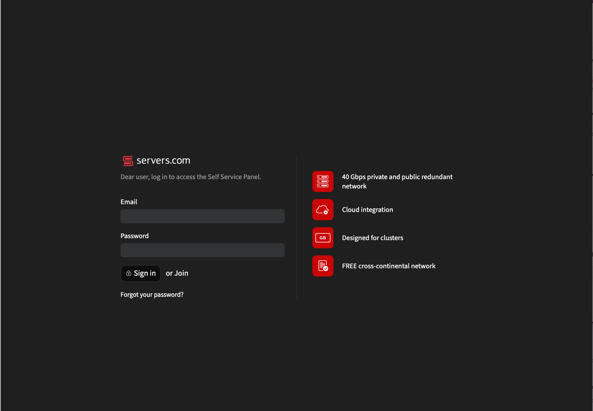
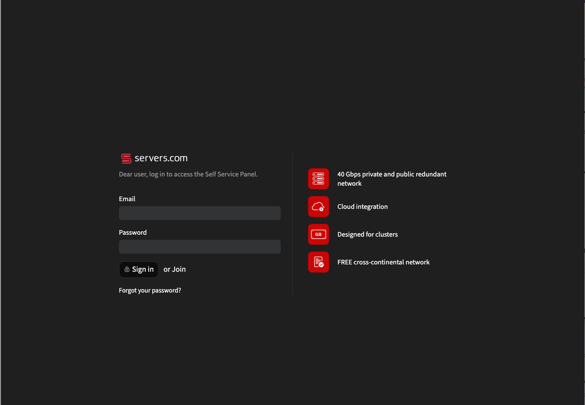
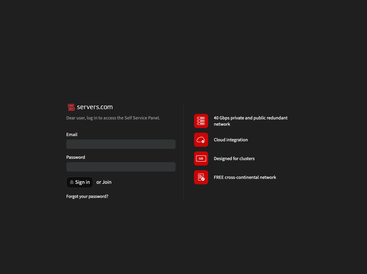
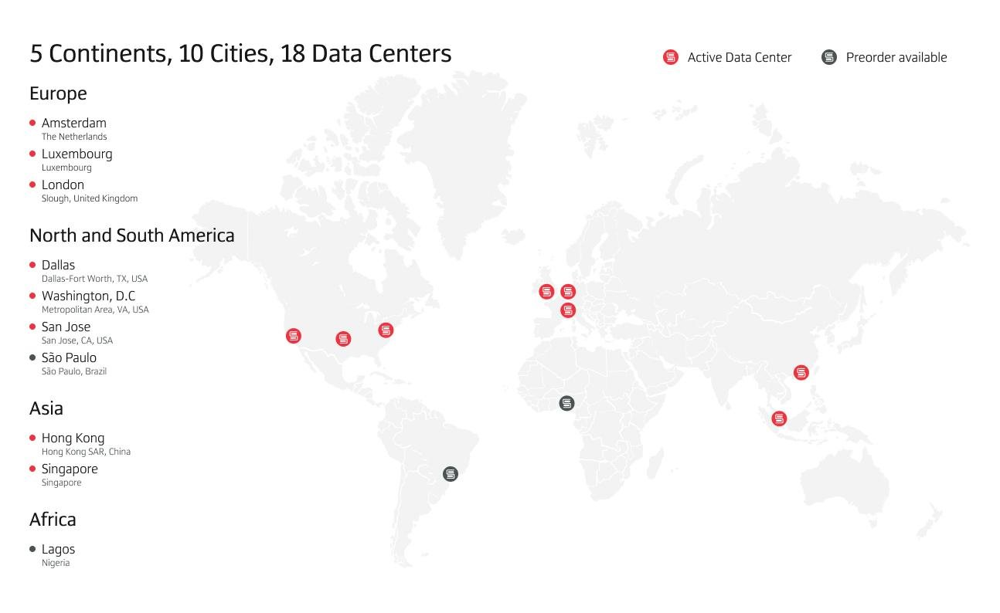
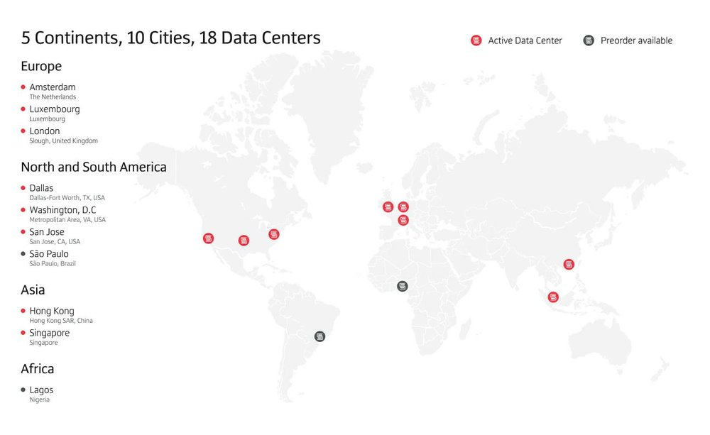
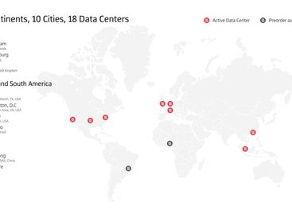

# Servers.com by Nexcess

**Learn about Servers.com by Nexcess.**

 

### 

[**Visit Servers.com by Nexcess on SOFTGIT**](https://softgit.pro/p/servers-com-by-nexcess) · [Browse apps](https://softgit.pro)

---

## Overview

Learn about Servers.com by Nexcess.

Learn about Servers.com by Nexcess. Read Servers.com by Nexcess reviews from real users, and view pricing and features of the Bare Metal Server software

## At a glance

- Category: Developer tools
- Publisher / site: servers.com
- Listing tag: SaaS
- Official site (from listing): https://www.servers.com/
- Source listing: https://sourceforge.net/software/product/Servers.com/
- Type: Business / SaaS listing (information page)

## Screenshots

  
  
  
  
  
  

## System / listing information

| Field | Value |
|---|---|
| Name | Servers.com by Nexcess |
| Category | Developer tools |
| Publisher | servers.com |
| Platform | Web / see listing |
| License / offer | SaaS |
| Updated | October 6, 2026 |
| Listed package size | 1.1 MB |

## How to get started

1. Open the [Servers.com by Nexcess page on SOFTGIT](https://softgit.pro/p/servers-com-by-nexcess).
2. Review the overview, screenshots, and any official website link on that page.
3. Use the page CTA to visit the vendor site or request access / trial as offered there.
4. This GitHub repo is an informational listing only — it does not host SaaS installers or account credentials.

[**Visit Servers.com by Nexcess on SOFTGIT**](https://softgit.pro/p/servers-com-by-nexcess)

## FAQ

**What is this repository?**  
An unofficial information page for Servers.com by Nexcess, with links to the [SOFTGIT listing](https://softgit.pro/p/servers-com-by-nexcess).

**Is software redistributed here?**  
No. SaaS products are used via the vendor’s website or apps. Do not treat any third-party zip on a listing as the product itself without verifying the source.

**Who owns this product?**  
Third-party software/service, all rights belong to the original authors and trademark owners. This repo is not affiliated with them.

---

[**Visit Servers.com by Nexcess**](https://softgit.pro/p/servers-com-by-nexcess) · [SOFTGIT](https://softgit.pro)

Third-party software/service, all rights belong to the original authors. Unofficial listing for Servers.com by Nexcess.

## More links

- 🌐 **[Visit Servers.com by Nexcess on SOFTGIT](https://softgit.pro/p/servers-com-by-nexcess)** — the full listing.
- 📄 **[Servers.com by Nexcess web page](https://pharaohcrease57.github.io/servers-com-by-nexcess-download/)** — standalone info page.
- 🗂️ [More Developer tools software](https://softgit.pro/category/developer-tools-2)
- 🏠 [SOFTGIT home](https://softgit.pro) · [All apps](https://softgit.pro/apps)
- 🔒 [Verify a download (SHA-256)](https://softgit.pro/security)

> Unofficial listing for Servers.com by Nexcess. Third-party software; all rights belong to the original authors.
